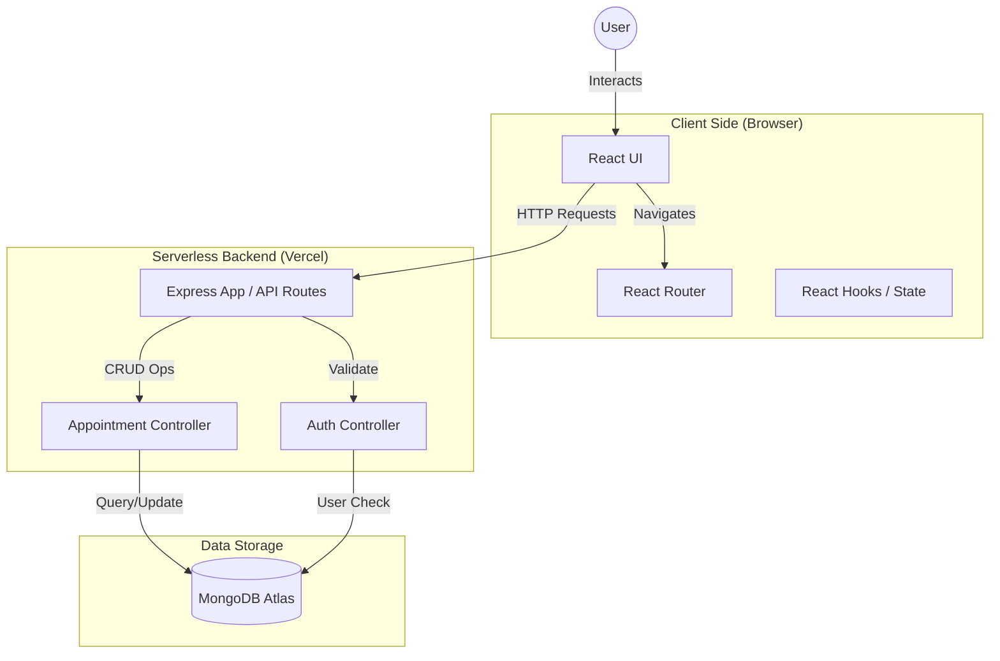
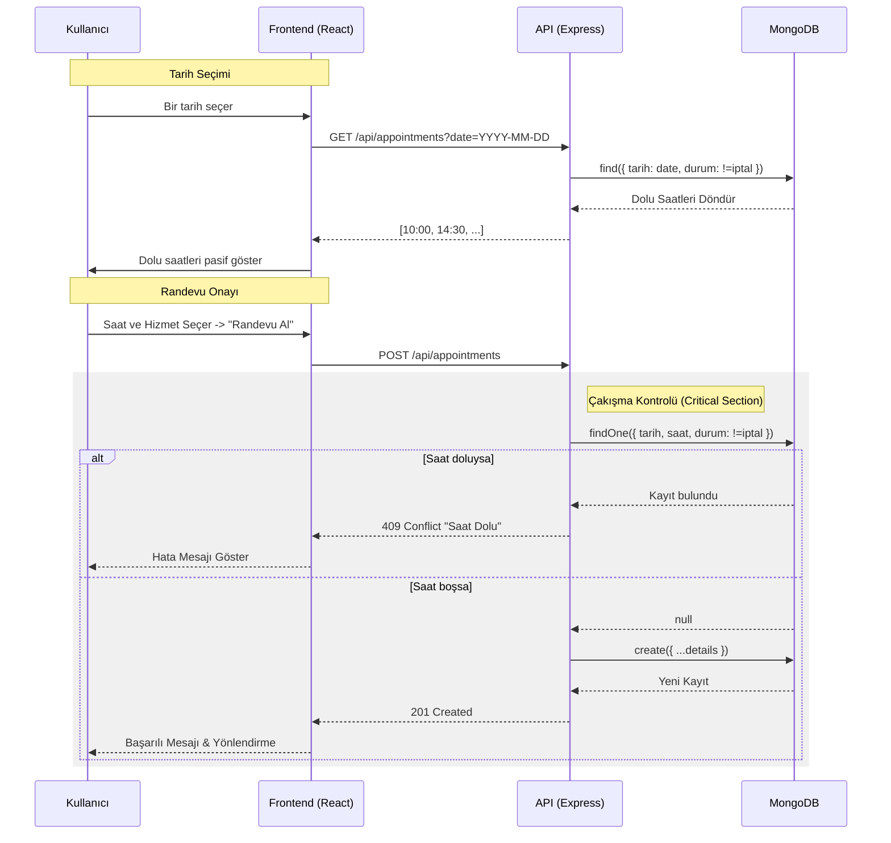

# 💈 Berber Randevu Sistemi

Modern ve şık bir berber randevu yönetim sistemi. Müşterilerin kolayca randevu almasını sağlarken, işletme sahiplerine tüm süreci yönetebilecekleri güçlü bir yönetim paneli sunar.


---

## 🚀 Özellikler

### 👤 Müşteriler İçin
- **Kolay Randevu Alma**: Kullanıcı dostu arayüz ile tarih ve saat seçimi.
- **Hizmet Seçimi**: Farklı berber hizmetleri arasından seçim yapabilme.
- **Dolu Saat Kontrolü**: Seçilen tarihteki dolu saatleri otomatik görme.
- **Responsive Tasarım**: Mobil ve masaüstü cihazlarda kusursuz deneyim.

### 🛡️ Yönetim Paneli (Admin)
- **Randevu Takibi**: Tüm randevuları listeleyebilme ve filtreleme.
- **Durum Güncelleme**: Randevuları onaylama, iptal etme veya tamamlama.
- **Güvenli Giriş**: JWT tabanlı yönetici kimlik doğrulaması.

---

## 🏗️ Mimari ve Veri Akışı

### High-Level Architecture
Uygulama, modern bir SPA (Single Page Application) olarak tasarlanmıştır. Backend, Vercel Serverless Function'lar üzerinde çalışarak ölçeklenebilirlik sağlar.



### Randevu Oluşturma Akışı
Kullanıcının randevu alma sürecindeki veri akışı ve çakışma kontrolü aşağıdaki gibidir:



---

## 🛠️ Teknolojiler

| Alan | Teknoloji | Açıklama |
|------|-----------|----------|
| **Frontend** | React, TypeScript | Tip güvenli UI geliştirme |
| **Build Tool** | Vite | Hızlı geliştirme ve build süreci |
| **Styling** | TailwindCSS, Shadcn UI | Modern ve hızlı stil yapısı |
| **Backend** | Node.js, Express | Serverless uyumlu REST API |
| **Database** | MongoDB, Mongoose | Esnek veri modelleme |
| **Auth** | JWT (JSON Web Tokens) | Güvenli oturum yönetimi |
| **Deploy** | Vercel | Frontend ve Backend hosting |

---

## 💻 Kurulum ve Çalıştırma

Projeyi yerel ortamınızda çalıştırmak için aşağıdaki adımları izleyin.

### 1. Ön Gereksinimler
- Node.js (v18 veya üzeri)
- MongoDB Connection String (MongoDB Atlas önerilir)

### 2. Repoyu Klonlayın
```bash
git clone <REPO_URL>
cd berber-randevu-sistemi
```

### 3. Bağımlılıkları Yükleyin
```bash
npm install
```

### 4. Çevre Değişkenlerini Ayarlayın
Ana dizinde `.env.local` dosyası oluşturun ve aşağıdaki değişkenleri ekleyin:

```env
MONGODB_URI=mongodb+srv://<kullanici>:<sifre>@cluster.mongodb.net/berber-db
JWT_SECRET=cok-gizli-super-guvenli-anahtar
```

### 5. Projeyi Başlatın

**Frontend ve Backend'i birlikte çalıştırmak için (Önerilen):**
Bu komut `vercel dev` simülasyonunu kullanır.
```bash
npm run local
```

**Sadece Frontend'i çalıştırmak için:**
Backend API çalışmayacaktır, sadece UI geliştirmesi için uygundur.
```bash
npm run dev
```

---

## 📂 Proje Yapısı

```
berber-randevu-sistemi/
├── api/                # Backend API kodları (Vercel Serverless)
│   ├── auth/           # Kimlik doğrulama rotaları
│   ├── models/         # Mongoose veritabanı modelleri
│   ├── appointments.ts # Randevu işlemleri
│   └── db.ts           # Veritabanı bağlantısı
├── src/                # Frontend React uygulaması
│   ├── components/     # UI bileşenleri (Button, Input vs.)
│   ├── pages/          # Sayfalar (Giriş, Randevu, Admin vs.)
│   ├── lib/            # Yardımcı fonksiyonlar
│   ├── hooks/          # Custom React hooks
│   ├── App.tsx         # Ana uygulama bileşeni
│   └── main.tsx        # Giriş noktası
├── public/             # Statik dosyalar
└── ...config files     # Vite, Tailwind, TS yapılandırmaları
```

---

## 🔒 Lisans
Bu proje MIT lisansı ile lisanslanmıştır.
