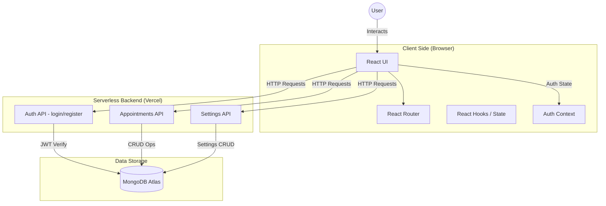
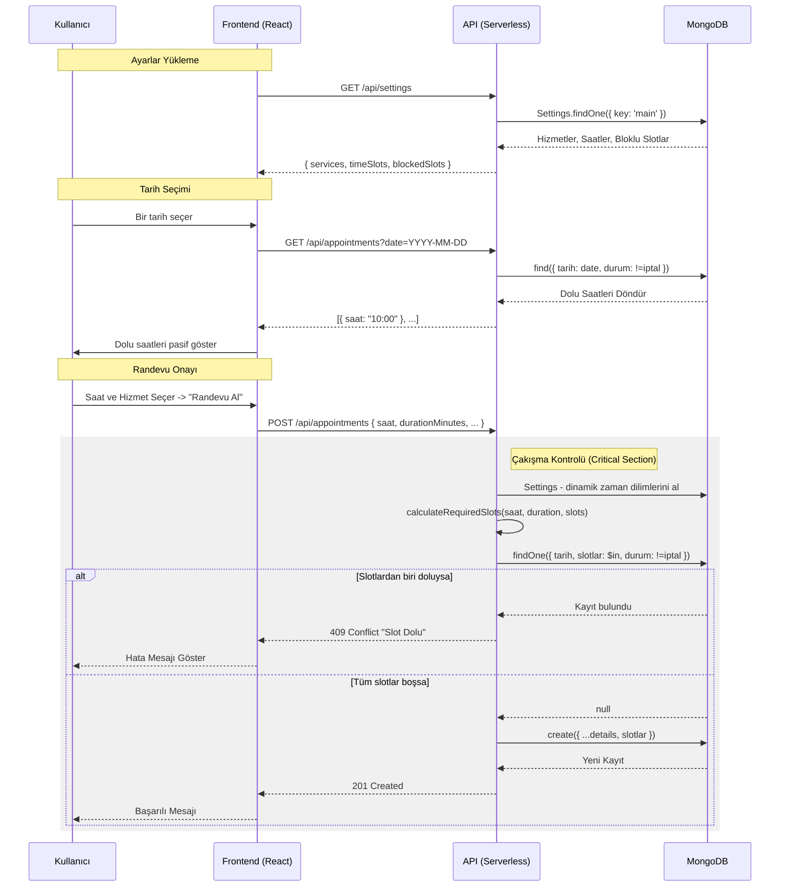

# 💈 Berber Randevu Sistemi

Modern ve şık bir berber randevu yönetim sistemi. Müşterilerin kolayca randevu almasını sağlarken, işletme sahiplerine tüm süreci yönetebilecekleri güçlü bir yönetim paneli sunar.

🔗 **Canlı Demo:** [asrandevu.com.tr](https://asrandevu.com.tr)


---

## 🚀 Özellikler

### 👤 Müşteriler İçin
- **Kolay Randevu Alma**: 3 adımlı kullanıcı dostu arayüz ile bilgi girişi, hizmet seçimi, tarih ve saat seçimi.
- **Hizmet Seçimi**: Farklı berber hizmetleri arasından seçim yapabilme (fiyat ve süre bilgisiyle).
- **Çoklu Slot Desteği**: Uzun süreli hizmetler (boyama, perma vb.) otomatik olarak ardışık slot hesaplaması yapar.
- **Dolu Saat Kontrolü**: Seçilen tarihteki dolu ve bloklu saatleri otomatik görme.
- **Kullanıcı Kayıt/Giriş**: Hesap oluşturma ve giriş yaparak bilgilerin otomatik doldurulması.
- **Responsive Tasarım**: Mobil ve masaüstü cihazlarda kusursuz deneyim.

### 🛡️ Yönetim Paneli (Admin)
- **Randevu Takibi**: Tüm randevuları listeleyebilme, tarihe göre filtreleme.
- **Durum Güncelleme**: Randevuları onaylama, iptal etme veya tamamlama.
- **Hizmet Yönetimi**: Hizmet ekleme, düzenleme, silme (isim, fiyat, süre, not).
- **Saat Dilimi Yönetimi**: Çalışma saatlerini dinamik olarak ekleme/kaldırma.
- **Slot Bloklama**: Belirli tarihlere özel saat dilimleri bloklayabilme.
- **Adres Yönetimi**: İşletme adresini yönetim panelinden düzenleyebilme.
- **Güvenli Giriş**: JWT tabanlı yönetici kimlik doğrulaması.

---

## 🏗️ Mimari ve Veri Akışı

### High-Level Architecture
Uygulama, modern bir SPA (Single Page Application) olarak tasarlanmıştır. Backend, Vercel Serverless Function'lar üzerinde çalışarak ölçeklenebilirlik sağlar.


```mermaid
graph TD
    subgraph Client ["Client Side (Browser)"]
        UI[React UI]
        Router[React Router]
        State[React Hooks / State]
        AuthCtx[Auth Context]
    end

    subgraph Server ["Serverless Backend (Vercel)"]
        AuthAPI[Auth API - login/register]
        AptAPI[Appointments API]
        SetAPI[Settings API]
    end

    subgraph Database ["Data Storage"]
        Mongo[(MongoDB Atlas)]
    end

    User((User)) -->|Interacts| UI
    UI --> Router
    UI -->|Auth State| AuthCtx
    UI -->|HTTP Requests| AuthAPI
    UI -->|HTTP Requests| AptAPI
    UI -->|HTTP Requests| SetAPI
    
    AuthAPI -->|JWT Verify| Mongo
    AptAPI -->|CRUD Ops| Mongo
    SetAPI -->|Settings CRUD| Mongo
```

### Randevu Oluşturma Akışı
Kullanıcının randevu alma sürecindeki veri akışı ve çakışma kontrolü aşağıdaki gibidir:


```mermaid
sequenceDiagram
    participant U as Kullanıcı
    participant FE as Frontend (React)
    participant API as API (Serverless)
    participant DB as MongoDB

    Note over U, FE: Ayarlar Yükleme
    FE->>API: GET /api/settings
    API->>DB: Settings.findOne({ key: 'main' })
    DB-->>API: Hizmetler, Saatler, Bloklu Slotlar
    API-->>FE: { services, timeSlots, blockedSlots }

    Note over U, FE: Tarih Seçimi
    U->>FE: Bir tarih seçer
    FE->>API: GET /api/appointments?date=YYYY-MM-DD
    API->>DB: find({ tarih: date, durum: !=iptal })
    DB-->>API: Dolu Saatleri Döndür
    API-->>FE: [{ saat: "10:00" }, ...]
    FE->>U: Dolu saatleri pasif göster

    Note over U, FE: Randevu Onayı
    U->>FE: Saat ve Hizmet Seçer -> "Randevu Al"
    FE->>API: POST /api/appointments { saat, durationMinutes, ... }
    
    rect rgb(240, 240, 240)
        Note right of API: Çakışma Kontrolü (Critical Section)
        API->>DB: Settings - dinamik zaman dilimlerini al
        API->>API: calculateRequiredSlots(saat, duration, slots)
        API->>DB: findOne({ tarih, slotlar: $in, durum: !=iptal })
        alt Slotlardan biri doluysa
            DB-->>API: Kayıt bulundu
            API-->>FE: 409 Conflict "Slot Dolu"
            FE-->>U: Hata Mesajı Göster
        else Tüm slotlar boşsa
            DB-->>API: null
            API->>DB: create({ ...details, slotlar })
            DB-->>API: Yeni Kayıt
            API-->>FE: 201 Created
            FE-->>U: Başarılı Mesajı
        end
    end
```

---

## 🛠️ Teknolojiler

| Alan | Teknoloji | Açıklama |
|------|-----------|----------|
| **Frontend** | React 18, TypeScript 5 | Tip güvenli UI geliştirme |
| **Build Tool** | Vite 5 | Hızlı geliştirme ve build süreci |
| **Styling** | TailwindCSS 3, Shadcn UI | Modern ve hızlı stil yapısı |
| **State Management** | React Context, TanStack Query | Auth durumu ve veri yönetimi |
| **Backend** | Node.js, Vercel Serverless Functions | Ölçeklenebilir REST API |
| **Database** | MongoDB Atlas, Mongoose 9 | Esnek veri modelleme |
| **Auth** | JWT, bcryptjs | Güvenli oturum ve şifre yönetimi |
| **Deploy** | Vercel | Zero-config frontend ve backend hosting |

---

## 📡 API Endpoints

| Metot | Endpoint | Açıklama | Auth |
|-------|----------|----------|------|
| `GET` | `/api/settings` | Hizmetler, zaman dilimleri, bloklu slotlar ve adres bilgisini döndürür | ❌ |
| `PUT` | `/api/settings` | Ayarları günceller (hizmetler, slotlar, adres vb.) | ✅ Admin |
| `GET` | `/api/appointments?date=YYYY-MM-DD` | Belirli tarihteki dolu slotları döndürür | ❌ |
| `GET` | `/api/appointments?all=true` | Tüm randevuları listeler (admin panel) | ❌ |
| `POST` | `/api/appointments` | Yeni randevu oluşturur (çakışma kontrolü ile) | ❌ |
| `PUT` | `/api/appointments` | Randevu durumunu günceller (onay, iptal, tamamlama) | ❌ |
| `DELETE` | `/api/appointments?id=...` | Randevuyu siler | ❌ |
| `POST` | `/api/auth/register` | Yeni kullanıcı kaydı | ❌ |
| `POST` | `/api/auth/login` | Kullanıcı/admin girişi (JWT döndürür) | ❌ |

---

## 💻 Kurulum ve Çalıştırma

Projeyi yerel ortamınızda çalıştırmak için aşağıdaki adımları izleyin.

### 1. Ön Gereksinimler
- Node.js (v18 veya üzeri)
- MongoDB Connection String (MongoDB Atlas önerilir)
- Vercel CLI (`npm i -g vercel`) — yerel geliştirme için

### 2. Repoyu Klonlayın
```bash
git clone https://github.com/kursat-dev/Berber-Randevu-Sistemi
cd Berber-Randevu-Sistemi
```

### 3. Bağımlılıkları Yükleyin
```bash
npm install
```

### 4. Çevre Değişkenlerini Ayarlayın
Ana dizinde `.env.local` dosyası oluşturun ve aşağıdaki değişkenleri ekleyin:

```env
MONGODB_URI=mongodb+srv://<kullanici>:<sifre>@cluster.mongodb.net/berber-db
JWT_SECRET=cok-gizli-super-guvenli-anahtar
```

### 5. Projeyi Başlatın

**Frontend ve Backend'i birlikte çalıştırmak için (Önerilen):**
Bu komut Vercel Dev ortamını simüle ederek API route'larını da çalıştırır.
```bash
npm run local
```

**Sadece Frontend'i çalıştırmak için:**
Backend API çalışmayacaktır, sadece UI geliştirmesi için uygundur.
```bash
npm run dev
```

### 6. Mevcut Scriptler

| Script | Komut | Açıklama |
|--------|-------|----------|
| `dev` | `npm run dev` | Sadece frontend dev server |
| `local` | `npm run local` | Vercel dev (frontend + API) |
| `build` | `npm run build` | Production build |
| `build:dev` | `npm run build:dev` | Development modunda build |
| `lint` | `npm run lint` | ESLint ile kod kontrolü |
| `test` | `npm run test` | Testleri çalıştır (Vitest) |
| `test:watch` | `npm run test:watch` | Testleri watch modunda çalıştır |

---

## 📂 Proje Yapısı

```
berber-randevu-sistemi/
├── api/                    # Backend API (Vercel Serverless Functions)
│   ├── auth/               # Kimlik doğrulama
│   │   ├── login.ts        # Giriş endpoint'i
│   │   └── register.ts     # Kayıt endpoint'i
│   ├── models/             # Mongoose modelleri
│   │   ├── Settings.ts     # Ayarlar (hizmetler, slotlar, adres)
│   │   └── User.ts         # Kullanıcı modeli
│   ├── appointments.ts     # Randevu CRUD işlemleri
│   ├── settings.ts         # Ayar okuma/güncelleme
│   └── db.ts               # MongoDB bağlantı yönetimi
├── src/                    # Frontend React uygulaması
│   ├── components/         # UI bileşenleri (Shadcn UI + özel)
│   │   └── Layout.tsx      # Genel sayfa layout'u (header, footer)
│   ├── contexts/           # React Context
│   │   └── AuthContext.tsx  # Kullanıcı oturum yönetimi
│   ├── pages/              # Sayfalar
│   │   ├── Home.tsx        # Ana sayfa
│   │   ├── Randevu.tsx     # Randevu alma sayfası (3 adımlı)
│   │   ├── Giris.tsx       # Kullanıcı giriş sayfası
│   │   ├── Kayit.tsx       # Kullanıcı kayıt sayfası
│   │   ├── Admin.tsx       # Yönetim paneli
│   │   └── NotFound.tsx    # 404 sayfası
│   ├── hooks/              # Custom React hook'ları
│   ├── lib/                # Yardımcı fonksiyonlar
│   ├── App.tsx             # Ana uygulama (routing)
│   └── main.tsx            # Giriş noktası
├── public/                 # Statik dosyalar
├── vercel.json             # Vercel rewrites yapılandırması
└── ...config files         # Vite, Tailwind, TS, ESLint yapılandırmaları
```

---

## 🚀 Deploy (Vercel)

Proje Vercel ile deploy edilmek üzere yapılandırılmıştır:

1. [Vercel Dashboard](https://vercel.com) üzerinden GitHub reposunu bağlayın.
2. Environment Variables bölümünden `MONGODB_URI` ve `JWT_SECRET` değişkenlerini ekleyin.
3. `main` branch'e her push'ta otomatik deploy tetiklenir.

Detaylı deploy rehberi için: [DEPLOYMENT.md](./DEPLOYMENT.md)

---

## 🔒 Lisans
Bu proje MIT lisansı ile lisanslanmıştır.
